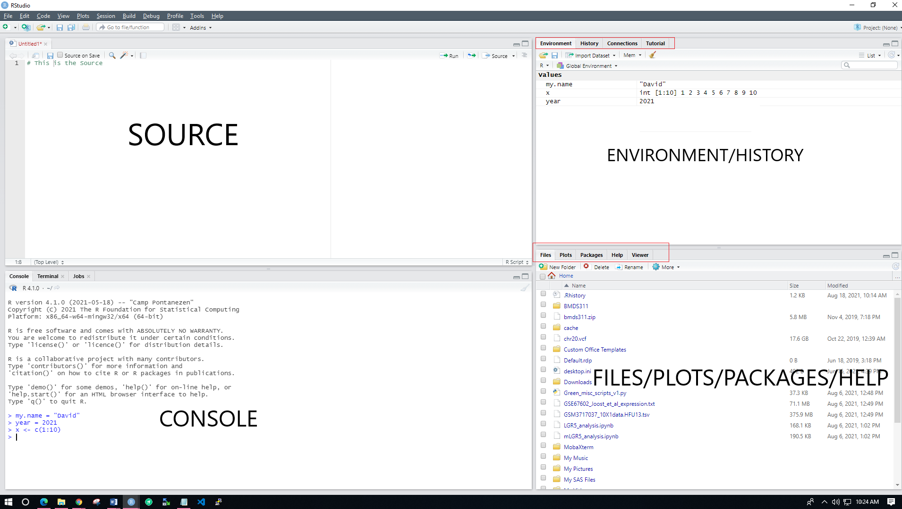
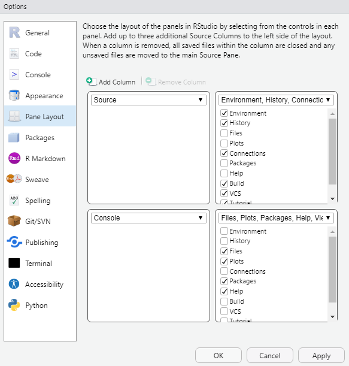
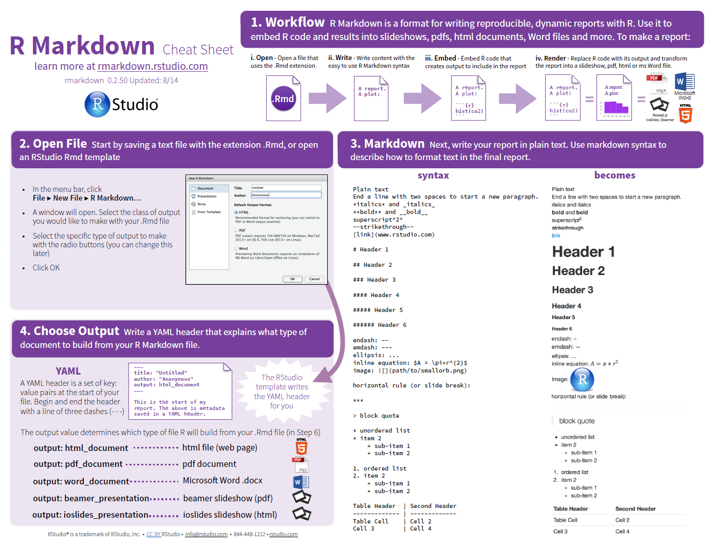
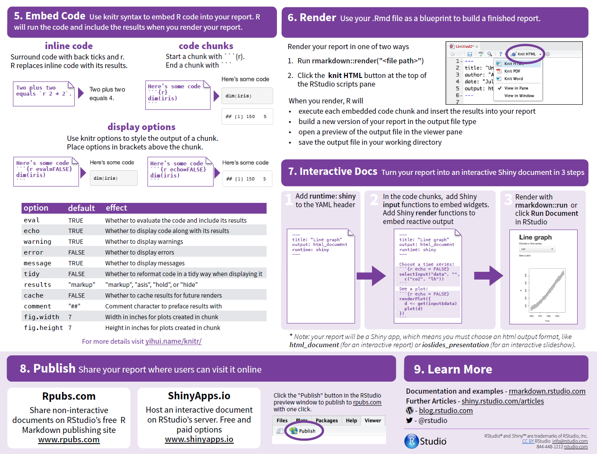

```{r setup, include=FALSE}
knitr::opts_chunk$set(echo = TRUE, comment = "")
```

## 01. Rstudio IDE Overview and Navigation  {.tabset}

### Learning outcomes

-   Opening and closing scripts 
-   Help documentation access 
-   The working directory and relative paths 
-   Assignment operator and object browser 
-   Rstudio Script Types – this course will focus on R markdown 
    -   .R vs .RMD and knitting to HTML output 

#### **The R Project**

R is a functional language and software environment for statistical computing and graphics.

-   R is free
-   R runs on Unix/Windows/OS X
-   R has a vibrant user community
-   R is open-source, meaning that users can "see under the hood."
-   R is a core language for modern bioinformatics (others include Perl, Python, C/C++)

### Navigating Rstudio

There are four basic work areas in Rstudio:

-   **Source:** The top-left corner of the screen contains a text editor that lets you work with source script files. Here, you can enter multiple lines of code, save your script file to disk, and perform other tasks on your script.

-   **Console:** In the bottom-left corner, you find the console. This is where you do all the interactive work with R.

-   **Workspace and history:** The top-right corner is a handy overview of your workspace, where you can inspect the variables you created in your session, as well as their values. This is also the area where you can see a history of the commands you've issued in R.

-   **Files, plots, package, and help:** In the bottom-right corner, you have access to several tools -

    -   Files: Browse folders and files on your computer.

    -   Plots: This is where R displays your plots (charts or graphs).

    -   Packages:View a list of all the installed packages.

    -   Help: browse the built-in Help system of R. Side note: This is equivalent to typing "?<insert_topic>" in console

<center>{width="900px"}</center>

#### **Changing Pane Layout**

The default pane layout can be reorganized by going to Tools --\> Global Options --\> Pane Layout (see below)

<center>{width="500px"}</center>


### A Sample R Session

#### **Expressions and variables**

Here is an example of an expression (and the result on the following line)

```{r}
2 + 2
```

#### **Assignment Operation is the <- or -> to a *object name* **

We can assign a new variable, 'x' to hold the contents of an expression for further evaluation. The command is read from left to right, so we use a left-pointing arrow to say 'x set to 2 plus 2.'

```{r}
x <- 2 + 2
```

Note that in this case, no output is produced. We can show the value of our x variable after it has been assigned by typing x into the console.

```{r}
x
```


#### **Commenting Code**
It is customary to comment pieces of code for reproducibility. In R, use a `#` before a comment so that it is not evaluated by R.

```{r}
# Set x to 4
x <- 2+2
# Print x
x
```


#### **Must be preceeded by 1 or more '#'**
If `#` is not included, R attempts to evaluate the line and produces an error. When an error occurs, R stops and does not evaluate further.

```{r, error = T}
Set x to 4
x <- 2+2
Print x
x
```


#### **R Functions and Multiple Values Assigned**
We can also assign 'x' to hold a vector of values using the concatenate function, `c()`. 

Here, we use the colon operator `:` to mean "through", so that `1:10` produces the values 1 through 10 and `100:11` produces values decreasing from 100 to 11. The concatenate function pastes the two resulting vectors together.

```{r}
# Set x to vector
x <- c(1:10, 100:11)

# What are the contents of x?
x
```

-   Note that we have reassigned x from 4 to this vector 
-   R is read left to right, top to bottom
-   So, we previously assigned x to 4, but further down in the document we reassign it to a vector of values, overwriting the value 4

#### **Brackets are used to *Subset* an Object**

-   Sometimes, our objects will be larger than the window, but we'd still like to peek at what our data look like
-   In R, we use brackets `[]` to select elements of our objects, so we can use these brackets to observe only a portion of x
-   *Note: R uses one-based array indexing unlike certain other programming languagues like C/Python/Java that use zero-based indexing!*

```{r}
# What are the contents of the first twenty values of my new x?
x[1:20]
```

#### **Applying functions to variables**

Once a variable is assigned, we can apply functions to it. For example, the `sort()` function will sort our numeric vector x. Here, we sort x and reassign the variable x to this sorted vector. Read left to right, this says 'x set to the sorted values of x.'

```{r}
# Sort x
x <- sort(x)
# What are the contents of the first twenty values of my new x?
x[1:20]
```

#### We can also assign new variables as the results of a function on an existing variable. In this case, we use `x^2` to square each element of x.

```{r}
# Assign y as a function of x
y <- x^2
# What are the contents of the first twenty values of y?
y[1:20]
```

#### **Global Environment** 
-   As variables are assigned, they are stored in the *global environment*
-   We can print the saved variables using `ls()`
-   When using the Rstudio IDE they are by default listed in the upper right window 

```{r}
ls()
```

#### **plot() function**
We use the `plot()` function to make a simple plot of x vs. y

```{r}
plot(x,y)
plot(x,y, 
     col = "slateblue4", 
     pch = 16,
     main = "X vs X^2",
     xlab = "Integer Values 1:100",
     ylab = "Squared Integer Values 1:100")
```

#### **Using Built-in HELP for functions** 
-   Type ?function (in this case `?plot`) to see information about function parameters, options and use cases 

#### **Basic directory navigation**

It is important to know where we are in our file system so that when we want to read in particular files, we can call them using the correct file path.

Our *working directory* tells us the exact location where we are working. We find this using the `getwd()` function.

```{r}
# Where am I? What is my working directory?
getwd()
```

#### **Important Notes** 
-   The working directory in an RMD code chunk is **always** the location of the .RMD file!
-   Whereas if you just open Rstudio - it is the default set up by R when you installed it 
-   Typing `getwd()` on the console command line will usually be **different** than having it be in a code chunk 


#### **Directory Listing **
Suppose we want to see which files are in our working directory. The `dir()` function will list out all files in the given file path. If no file path is given, it will list the files in the current working directory.

```{r}
dir()
```

Besides listing the direct file path, we can insert specific characters that will direct us to a particular directory. `"../"` directs us to the directory above our current working directory. `"~/"` directs us to our *home directory*, which is the directory assigned to our user profile. `"/"` will direct us to the *root directory*, the highest directory level on our computer system.

```{r}
# What files are in the next directory level up/back?
dir("../")

# What files are in my 'home' directory?
dir("~/")

# What files are in my root directory?
dir("/")
```

We can change our working directory using `setwd()` by giving it the file path for the directory we would like to work in. 

##### However, avoid this and use relative paths instead! 

#### **Reproducible Science** 

At the end of every workflow we should print what packages and R versions we are working with

```{r}
sessionInfo()
```


### Notes: Knitting with Rmarkdown

#### Output formats!

<https://bookdown.org/yihui/rmarkdown/output-formats.html>

-   beamer_presentation
-   context_document
-   github_document
-   **html_document**
-   ioslides_presentation
-   latex_document
-   md_document
-   odt_document
-   pdf_document
-   powerpoint_presentation
-   rtf_document
-   **slidy_presentation**
-   word_document

#### Screenshot of R Markdown Cheatsheet

 


### Activity

#### Exercise 1 
 
Whereami?  Print your working directory to the screen 
  
```{r}


```

#### Exercise 2  
   
Use R as a simple calculator to type in 3 or 4 mathematical operations and print to screen 

```{r}
## Example ## 
2+2


```


#### Exercise 3 

-   Using the `rnorm()` function create: 
    - an object named `x` with 100 values drawn from a random normal distribution
    - use the `plot()` function to plot `x` and change points to solid and color to `red` and title the plot, "100 values drawn from a random normal distribution"
        - Hint: `?plot.default` will help
    - use the `boxplot()` function to plot `x` and change color

```{r}

```


#### Exercise 4 
I've downloaded and unzipped a dataset with summary level information from the GTEx portal. https://gtexportal.org/home/downloads/adult-gtex/bulk_tissue_expression 

-   Ask R to print the names of the dataset with the `names()` function 
-   Ask R to print the first 6 records of the dataset with the `head()` function 


```{r}
## Read in the file 
gtex_summary_data <- read.delim2("GTEx_Analysis_2017-06-05_v8_RNASeQCv1.1.9_gene_median_tpm.gct", skip = 2) 
## Convert expression data columns to numeric 
gtex_summary_data[3:56] <- lapply(gtex_summary_data[3:56], as.numeric)

## Round Data to 3 decimal places for ease of printing 
gtex_summary_data[3:56] <- lapply(gtex_summary_data[3:56], function(x) round(x,3))

##  Ask R for column names 


##  Ask R for first 6 records 


```

#### Exercise 5

-   We can subset a column from the dataset with the `$` 
-   Plot the expression values of liver vs. lung with `plot()` with `red` circles 
-   Plot another plot with same two columns, but this time transform the data on the log scale 
    -   example - if `x` is a column of the dataset, then `log2(x+1)` will add 1 to every value and take the log2 of it 
-   Make sure to title your plots - type ?base::plot at the console if you need to see the options for plot 


```{r}
## Your code here 

```
  