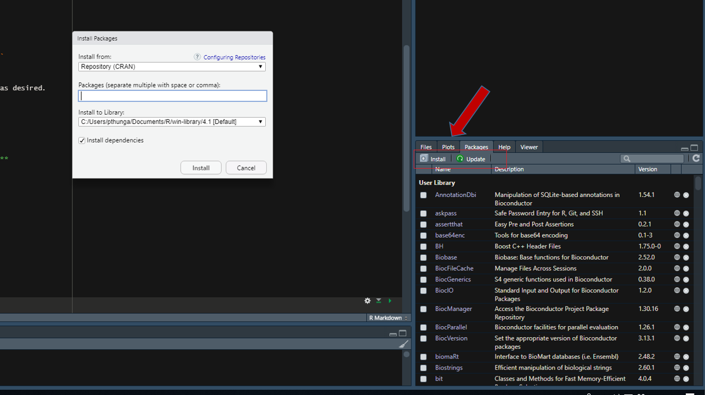

```{r setup, include=FALSE}
knitr::opts_chunk$set(echo = TRUE, comment = "")
```

## R Packages and Getting Data In and Out of R {.tabset}

### Learning Outcomes

-   Reproducibility in Data Science 
-   The basics of R packages
    -   what is a package and why do we use them?
-   Viewing and updating existing packages
-   Importing and Exporting Data
-   Getting Data in and Out of R from other file types

### Reproducibility

#### Reproducibility means if I give you:

-   my starting `(input)` data
-   my programming code `(source)`
-   the version(s) of software and packages used

#### Then you can **exactly** reproduce my results `(output)`

We can use R to create our project folder structure. First lets interrogate our working directory.

```{r}
# where am i
getwd()
# list the files in my working directory
list.files()
# list the directories in my working directory
list.dirs()
```

<h4 style="color:red", >"NOTE: Explanations between code chunks, but still annotating code itself with `#`"!</h4>

#### Then we can create our project folders

##### NOTE: `NOT` use spaces or special characters in the names of anything, especially file paths! You will thank me later.

Appropriate characters to use in naming of files, folders and variables consist of:

-   a dash `-`
-   an underscore `_`
-   a period `.`

NOTE: Forward and Backward Slashes **`/` and `\`** are used by operating systems to denote directory structures. When coding in R, always use a Forward Slash. It will seamlessly work with all 3 operating systems even though Windows uses `\`.

```{r eval=T}
dir.create("./Best_Science_Ever")
dir.create("./Best_Science_Ever/Input")
dir.create("./Best_Science_Ever/Output")
dir.create("./Best_Science_Ever/Source")
```

##### Use R to show our folder

```{r}
list.dirs("./Best_Science_Ever/")
```

##### Then at the end of each script, we print `sessionInfo()` to the screen.

```{r}
sessionInfo()
```

### **R Packages**

**What is a package?**

Packages are collections of functions and/or data sets usually developed by the community. They increase the power of R by improving existing base R functionalities, or by adding new ones. Typically, a package will include code (not only R code!), documentation for the package and the functions inside, some tests to check everything works as it should, and data sets.

**What is a repository?**

Packages may either be distributed as part of a basic R download or downloaded from public repositories. A repository is where packages are located so we can install from them. They are typically online and accessible to everyone, although one can have a local(i.e., private) repository. Here are 3 of the most popular repositories for R packages:

-   [**CRAN**](https://cran.r-project.org/): the official repository, it is a network of ftp and web servers maintained by the R community around the world. The R foundation coordinates it, and for a package to be published here, it needs to pass several tests that ensure the package is following CRAN policies. This repository currently features over 18000 packages!

-   [**Bioconductor**](https://www.bioconductor.org/): this is a topic specific repository, intended for open source software for bioinformatics. As CRAN, it has its own submission and review processes with an active user community. We will use a few packages from Bioconductor later in the semester.

-   [**Github**](https://github.com/) : although this is not R specific, Github is probably the most popular repository for open source projects. Its popularity comes from the unlimited space for open source, the integration with git, a version control software, and its ease to share and collaborate with others. However, there is no review process associated with repositories published on Github.

##### **Installing and Updating packages**

-   Where can I find packages that I need?
    -   <http://cran.r-project.org/web/packages/>\
    -   <http://cran.r-project.org/web/views/>\
    -   <http://www.bioconductor.org/>\
-   <http://cran.r-project.org/doc/manuals/R-admin.html>\
-   Embedded commands: `install.packages()`, `update.packages()`\
-   Point-and-click installation from a menu (Packages --\> Install)

<center>{width="850px"}</center>

##### **Where are my packages installed?**

Packages are stored in your library and may be loaded for use as desired. While you typically have to download/install a package only once, it must be loaded to the current session every time you need to use any function that comes with it.

-   What packages do I currently have installed? `library()`\
-   Which packages are currently loaded? `search()`

##### **Reading package (and associated function) documentation**

-   Packages:
    -   Manuals\
    -   Vignettes\
    -   READMEs\
    -   Examples\
-   Functions:
    -   Description\
    -   Usage\
    -   Arguments\
    -   Value\
    -   See also\
    -   Examples

### Sample R Code

#### **Loading packages**

```{r eval = F}
# What packages do I currently have installed? 
library() # Opens window listing all installed packages
# Which packages are currently loaded?  
search() # Prints loaded packages to console. 
```

#### **Installing and updating packages**

```{r eval = F}
# Install ggplot2
install.packages("ggplot2", repos = "https://cloud.r-project.org")
# Update ggplot2
update.packages("ggplot2", repos = "https://cloud.r-project.org")
```

#### **Getting help with packages and functions**

```{r eval = F}
# Load in the ggplot2 package
library(ggplot2)
```


#####  Finding package documentation 

##### `?ggplot2` 

##### Finding function documentation
##### `?geom_boxplot`


### Importing and Exporting Data 


##### can type ? in front of any of these to see expected parameters
##### Most Flat File type data can be read with one or more of the following 

```{r eval=F}
## Base R functions
read.csv()
write.csv()
read.table()
write.table()

## Tidyverse
read_csv()
write_csv()
read_delim()
write_delim()

## data.table (my favorite!)
fread()
fwrite()

## readxl
read_xls()
read_xlsx()
read_excel()
```

##### Example Dataset from https://www.ncbi.nlm.nih.gov/geo/query/acc.cgi?acc=GSE216849 

```{r eval=T}
## example
library(data.table)
fread("GSE216849_Fadu_CCND1_KO.tsv") -> myfile
head(myfile)
fread("GSE216849_Fadu_CCND1_KO.tsv.gz") -> myfile2
head(myfile2)
```

#### Fread from library(data.table) is my favorite 

-   Will make educated guess on the type of delimiter without specification
-   By default, does not read in character variables and try to factorize them
-   Extremely fast reads and writes (multithreaded too if not on a Mac)
-   Will read and write .gz compressed files

#### Additional Resource
-   #### https://bookdown.org/rdpeng/rprogdatascience/getting-data-in-and-out-of-r.html#

### Activity

Find a package that will draw heatmaps. Is this answer unique?

-   Install the package
-   Use that package to create a heatmap of the `mtcars` dataset

NOTE: you should probably modify the mtcars dataset first with the `scale()` function

**mydf \<- scale(mtcars)**

Then use your package to make a heatmap with the **mydf** object
