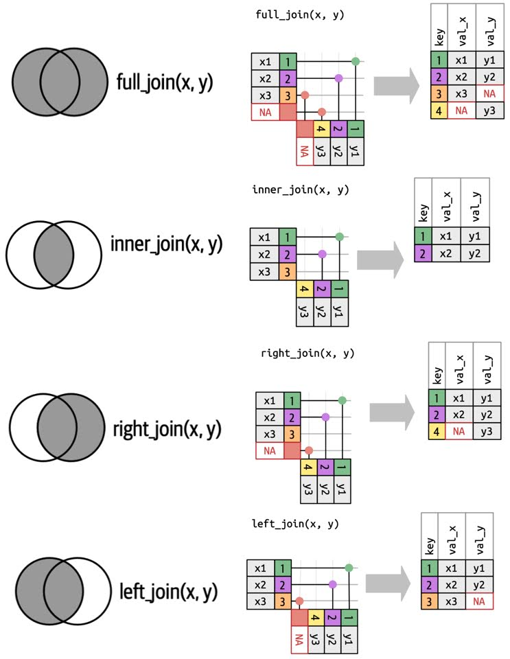

## Options for Session 

```{r setup, message=F, warning=F}
knitr::opts_chunk$set(echo = TRUE, comment = "")
library(tidyverse)
library(kableExtra)

```

## Joining Data with Dplyr

## Combining Vectors 

#### Define some vectors 
* Remember vectors only have **one** dimension -> length 

```{r}
## Define a vector containing the last 10 years 
last10years <- c(2014:2023)
last10years
length(last10years)
class(last10years)

## Define a vector containing the first 10 letters of the alphabet 
first10letters <- LETTERS[1:10]
first10letters
length(letters)
class(letters)
```

## We can *concatenate* vectors with the c() function 

```{r}
years_letters <- c(last10years, first10letters)
years_letters
length(years_letters)
class(years_letters)
```

#### What do you notice about the combined `years_letters` object?

## We can combined two 1-dimensional objects into a single 2-dimensional object using `cbind()` and `rbind()`

```{r}
rbind(last10years, first10letters) -> rbind_object
rbind_object
class(rbind_object)
dim(rbind_object)
```

## Combine Columns instead 

```{r}
cbind(last10years, first10letters) -> cbind_object
cbind_object
class(cbind_object)
dim(cbind_object)
```

## We can coerce to a dataframe with as.data.frame() 

```{r}
as.data.frame(rbind_object)
as.data.frame(cbind_object)
```

## R will recycle and autofill when combining things of different lengths 
-   Sometimes exactly what you want 
-   But be aware 

```{r}
years <- paste0("Year", 2000:2009)
years
breeds <- c("Pug","Springer-Spaniel", "Blue-tick")
breeds
category <- "Best in Show"
category


mydata <- cbind(Year = years, Dog_Breed = breeds, Category = category)
mydata

```


## Using Tidyverse to Join Datasets 

#### A good reference is the R for Data Science Resource - https://r4ds.hadley.nz/joins.html 

#### In order to join datasets, each one must have a "KEY" or a column that is the same variable 

##### Example Keys 
    -   patient ID
    -   rsID for SNPs 
    -   Gene Name 
    -   plane tail number 

#### Different Kinds of Joins 

<center>      
{width=900px}  
</center> 


## Joins with Simple Examples 

#### We have two datasets as follows 

```{r echo = F}
X <- structure(list(ensembl_gene_id = c("ENSG00000186092", "ENSG00000284733", 
"ENSG00000284662", "ENSG00000187634", "ENSG00000188976", "ENSG00000187961"
), entrezgene_description = c("olfactory receptor family 4 subfamily F member 5", 
"olfactory receptor family 4 subfamily F member 29", "olfactory receptor family 4 subfamily F member 16", 
"sterile alpha motif domain containing 11", "NOC2 like nucleolar associated transcriptional repressor", 
"kelch like family member 17"), external_gene_name = c("OR4F5", 
"OR4F29", "OR4F16", "SAMD11", "NOC2L", "KLHL17")), row.names = c(NA, 
6L), class = "data.frame")
rownames(X) <- NULL

Y <- structure(list(external_gene_name = c("OR4F16", "SAMD11", "NOC2L", 
"KLHL17", "PLEKHN1", "PERM1", "HES4"), gene_biotype = c("protein_coding", 
"protein_coding", "protein_coding", "protein_coding", "protein_coding", 
"protein_coding", "protein_coding"), chromosome_name = c("1", 
"1", "1", "1", "1", "1", "1"), start_position = c(685716L, 923923L, 
944203L, 960584L, 966482L, 975198L, 998962L), end_position = c(686654L, 
944575L, 959309L, 965719L, 975865L, 982117L, 1000172L)), row.names = 3:9, class = "data.frame")
rownames(Y) <- NULL

X %>% kbl(caption = "Dataset X") %>%
  kable_classic_2(full_width = F) %>% 
  column_spec(1:3, background = "lightyellow")
Y %>% kbl(caption = "Dataset Y") %>%
  kable_classic_2(full_width = F) %>% 
  column_spec(1:5, background = "lightgreen")

```

#### Say we wanted to join these to datasets? What do you think the key would be? 

## Full Join - Keep all records for keys found in either (sometimes called an outer join)

```{r}
full_join(X, Y, by = "external_gene_name") %>% 
  kbl(caption = "Full Join of X and Y - blue are records in BOTH X and Y: Key = dodgerblue") %>%
  kable_classic_2(full_width = F) %>% 
  row_spec(3:6, background = "lightblue") %>% 
  column_spec(3, background = "dodgerblue")
```
<center>      
{width=600px}  

## Inner Join - Only keep records for which the key exists in both datasets

```{r}
inner_join(X, Y, by = "external_gene_name") %>% 
  kbl(caption = "Full Join of X and Y - blue are records in BOTH X and Y: Key = dodgerblue") %>%
  kable_classic_2(full_width = F) %>% 
  row_spec(1:4, background = "lightblue") %>% 
  column_spec(3, background = "dodgerblue")
```

<center>      
{width=600px}  

## A left Join - Keep all keys in the left dataset and pull records where exist for keys also in second dataset

```{r}
left_join(X, Y, by = "external_gene_name") %>% 
  kbl(caption = "Left Join with X (yellow) and Y (green): Key = blue") %>%
  kable_classic_2(full_width = F) %>% 
  column_spec(1:2, background = "lightyellow") %>% 
  column_spec(3, background = "lightblue") %>% 
  column_spec(4:7, background = "lightgreen")

```

#### Notice we have all records from X (yellow), and not the records from Y that were NOT in X 
<center>      
{width=600px}  

## What if we switched X and Y 

```{r}
left_join(Y, X, by = "external_gene_name") %>% 
  kbl(caption = "Left Join with Y first (green), then X (yellow) : Key = blue") %>%
  kable_classic_2(full_width = F) %>% 
  column_spec(2:5, background = "lightgreen") %>% 
  column_spec(1, background = "lightblue") %>% 
  column_spec(6:7, background = "lightyellow")
```

#### Notice we have all records from Y (green), and not the records from X that were NOT in Y 

#### Notice that the columns of the dataset listed first are ones listed first after being joined  

#### For a left join - the records from the left dataset are kept regardless of whether they exist in the right dataset!
<center>      
{width=600px}  

## Right Join - Similar to left - But records from the right dataset are kept regardless of whether they exist in the left 

```{r}
right_join(Y, X, by = "external_gene_name") %>% 
  kbl(caption = "Left Join with Y first (green), then X (yellow) : Key = blue") %>%
  kable_classic_2(full_width = F) %>% 
  column_spec(2:5, background = "lightgreen") %>% 
  column_spec(1, background = "lightblue") %>% 
  column_spec(6:7, background = "lightyellow")
```

<center>      
{width=600px}  

## If the key has two different names, you can modify the `by` statement 

#### `by = c("KeynameX" = "KeynameY")`

```{r}
X <- X %>% rename(gene = "external_gene_name")
X

inner_join(X, Y, by = c("gene" = "external_gene_name")) %>% ## See the By statement 
  kbl(caption = "Full Join of X and Y - blue are records in BOTH X and Y: Key = dodgerblue") %>%
  kable_classic_2(full_width = F) %>% 
  row_spec(1:4, background = "lightblue") %>% 
  column_spec(3, background = "dodgerblue")
```


#### More complicated examples can be found https://r4ds.hadley.nz/joins.html#fig-join-right 


## Keys can consist of multiple columns!

```{r message = FALSE}
## Print 10 records of Diamonds dataset

diamonds %>% head(10) %>% 
  kbl(caption = "First 10 Records of Diamonds Dataset") %>%
  kable_classic_2(full_width = F)

## Calculate some summary statistics
diamonds %>% group_by(cut, color, clarity) %>% 
  summarize(average_size = round(mean(carat),2), 
            average_price = round(mean(price),0), 
            Records_in_Dataset = n()) %>% 
  arrange(desc(cut)) -> diamonds_summary

## Print 10 records of the Diamonds Summary stats
diamonds_summary %>% head(10) %>% 
  kbl(caption = "First 10 records of my Summary Information of Diamonds Dataset By cut, color, and clarity") %>%
  kable_classic_2(full_width = F) %>% 
  column_spec(1:6,background = "lightyellow")
```

## Say we want to join the Summary Information to the Original Diamonds Dataset? 

#### Given our calculations were `group_by(cut, color, clarity)`, that is the key we need to specify 

```{r}

mydiamonds <- full_join(diamonds, diamonds_summary, 
                        by = c("cut", "color", "clarity")) %>% ## Notice the 3-field Key
  mutate(Percent_of_Avg_Size = round(carat/average_size,2)) ## Calculate a New field based off of joined data!

## print 10 records from joined dataset 
mydiamonds %>% 
  head(10) %>% 
  kbl(caption = "First 10 records Joined Dataset with summary information By cut, color, and clarity with the triple KEY in blue") %>%
  kable_classic_2(full_width = F) %>% 
  column_spec(c(2:4), background = "lightblue") %>% 
  column_spec(c(11:13), background = "lightyellow")
```

#### Now our printed table has information at the lowest level, but also with summarized data in yellow columns

## Activity 

From https://www.epa.gov/compliance-and-fuel-economy-data/data-cars-used-testing-fuel-economy 
I downloaded 2010 and 2024

- Load two datasets (done for you in code below)
- Examine their columns 


#### Summarize each Dataset By:
-   `Vehicle Manufacturer Name` and by 
-   `Vehicle Type` and by 
-   `Test Category` and by 
-   `Tested Transmission Type`

#### And Get The following 

-   Number of records tested - hint:  look at data mungting lecture
-   average `Equivalent Test Weight (lbs.)` 
-   average `CO2 (g/mi)`
-   Print first 10 lines of each new summarized dataset 

#### You will want to name the summary stats pertinent to the dataset (i.e.  meanC02_2010 vs. meanC02_2024) 

```{r}
cars2010 <- read_csv(file = "2010testcar.csv")
cars2024 <- read_csv(file = "2024testcar.csv")
## 
```

#### Conduct each of the 4 joins with the quadruple key and your twodatasets

```{r}

```


